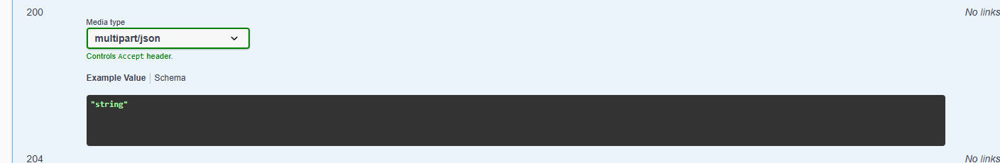

# Beeteller PIX API

Uma API para **coleta de mensagens PIX** com foco em **concorrência**, **não-duplicação** e **alta disponibilidade**.

A dinâmica é simples (e bem parecida com o que o cliente SPI faria): o PSP abre um stream, a API segura a conexão com **long polling (até 8s)** e devolve mensagens assim que tiver algo disponível — sempre orientando o próximo passo pelo header **`Pull-Next`**.

---

## ✅ Requisitos

- Long polling com tempo máximo de espera de **8 segundos**
- Até **6 streams simultâneos por ISPB** (acima disso: **429**)
- Mensagens **não aparecem em mais de um stream** (sem duplicação)
- Suporte a **1 mensagem** (`application/json`) ou **até 10 mensagens** (`multipart/json`)
- Header **`Pull-Next`** em todas as interações (inclusive quando o retorno é **204**)
- Endpoint utilitário para **gerar mensagens fake** (para testes)

---

## 🚀 Deploy rápido (Render)

Esses foram os passos que segui para subir a API no Render:

1. Fork este repositório
2. Acesse o Render Dashboard
3. New → Blueprint → conecte seu repositório
4. O `render.yaml` sobe tudo automaticamente

Acesse a API no Render: https://pix-api-09kp.onrender.com/api/docs/

---

## 🧰 Stack / Tecnologias

- **Django 5** + **Django REST Framework**
- **PostgreSQL** (persistência)
- **Redis** (controle de streams concorrentes)
- **Uvicorn** (ASGI / async)
- **Docker** + **Docker Compose**
- **Locust** (Teste de carga)

---

## 🏃 Rodando localmente

Copiar o .env.example para .env e preencher com as mesmas credenciais do .env.example para rodar localmente.
cp .env.example .env 

### Pré-requisitos

- Docker e Docker Compose

### Subir os containers

```bash
git clone https://github.com/ItaloTargino123/pix-api.git
cd pix-api
docker-compose up -d
```

### Rodar as migrations

```bash
docker-compose exec api python manage.py migrate
```

### Acessar

| Serviço | URL |
|--------|-----|
| Swagger UI | http://localhost:8000/api/docs/ |
| Base da API | http://localhost:8000/api/pix/ |

O swagger tem algumas limitações no campo de headers, tem que manualmente mudar para o header `Accept` para `multipart/json`.

---

## 🧠 Como a coleta funciona (o “fluxo mental” do PSP seguindo os requisitos)

1. O PSP chama **`GET /api/pix/{ispb}/stream/start`** para abrir um stream.
2. A resposta sempre vem com um **`Pull-Next`**, que aponta para o próximo endpoint do stream.
3. O PSP continua chamando o `Pull-Next` (loop) até decidir parar.
4. Para encerrar de forma correta e liberar o stream, o PSP chama **`DELETE`** no último `Pull-Next` recebido.

### Status codes esperados

- **200**: retornou mensagem(ns)
- **204**: não havia mensagem disponível dentro do tempo de long polling (mas ainda assim retorna `Pull-Next`)
- **429**: bateu o limite de **6 streams simultâneos** para o mesmo ISPB

### Regras importantes

- O ISPB do path é usado como chave de leitura: a API retorna somente mensagens em que **`recebedor.ispb == {ispb}`**.
- Mensagens já entregues em um stream **não podem reaparecer** em outra chamada (ou em outro stream simultâneo).
- Mesmo em `multipart/json`, a API responde assim que houver **ao menos 1 mensagem** disponível — ela não “espera encher 10”.

---

## 📌 Endpoints

### Streams

| Método | Endpoint | O que faz |
|--------|----------|----------|
| GET | `/api/pix/{ispb}/stream/start` | Abre um stream novo (primeira leitura) |
| GET | `/api/pix/{ispb}/stream/{interationId}` | Continua a leitura do stream (long polling) |
| DELETE | `/api/pix/{ispb}/stream/{interationId}` | Encerra o stream e libera para outros coletores |

### Endpoint utilitário (testes)

| Método | Endpoint | O que faz |
|--------|----------|----------|
| POST | `/api/pix/util/msgs/{ispb}/{quantity}/` | Gera `quantity` mensagens fake na base, marcando esse `ispb` como recebedor |

> Observação: a especificação original do desafio também descreve um endpoint utilitário para inserir mensagens fake. O importante aqui é existir um endpoint simples que permita simular entrada de mensagens para validação e testes.

---

## 📦 Formatos de resposta

Você escolhe o formato pelo header `Accept`:

| Accept | Resultado |
|--------|----------|
| `application/json` (ou ausente) | Retorna **1** mensagem |
| `multipart/json` | Retorna **até 10** mensagens |

Alternativa (se suportado no cliente): `?format=multipart`

---

## 🧪 Exemplos (curl)

Para usar o que esta rodando na cloud, use a url https://pix-api-09kp.onrender.com/api/docs/, visite o site primeiro para iniciar o server.

### 1) Gerar mensagens fake

```bash
curl -X POST http://localhost:8000/api/pix/util/msgs/32074986/10/

ou

curl -X POST https://pix-api-09kp.onrender.com/api/pix/util/msgs/32074986/10/
```

### 2) Iniciar um stream (1 mensagem por vez)

```bash
curl -i -H "Accept: application/json" \
  http://localhost:8000/api/pix/32074986/stream/start

ou

curl -i -H "Accept: application/json" \
  https://pix-api-09kp.onrender.com/api/pix/32074986/stream/start
```

Se houver mensagem disponível, você recebe `200` e um `Pull-Next`:

```text
HTTP/1.1 200 OK
Pull-Next: /api/pix/32074986/stream/17myxj5wskjf
Content-Type: application/json
```

### 3) Continuar a leitura (long polling)

```bash
curl -i -H "Accept: application/json" \
  http://localhost:8000/api/pix/32074986/stream/17myxj5wskjf

ou

curl -i -H "Accept: application/json" \
  https://pix-api-09kp.onrender.com/api/pix/32074986/stream/17myxj5wskjf
```

- Se chegar mensagem dentro do tempo: **200**
- Se não chegar nada em até ~8s: **204** (e ainda assim vem `Pull-Next`)

### 4) Multipart (até 10 mensagens)

```bash
curl -i -H "Accept: multipart/json" \
  http://localhost:8000/api/pix/32074986/stream/start

ou

curl -i -H "Accept: multipart/json" \
  https://pix-api-09kp.onrender.com/api/pix/32074986/stream/start
```

### 5) Encerrar o stream

Use o último `Pull-Next` que você recebeu:

```bash
curl -X DELETE http://localhost:8000/api/pix/32074986/stream/9kp6a6l7c2ii

ou

curl -X DELETE https://pix-api-09kp.onrender.com/api/pix/32074986/stream/9kp6a6l7c2ii
```

---

## 🏗️ Arquitetura (visão rápida)

- **Redis**: controla concorrência (limite de streams por ISPB) e evita corrida na abertura/fechamento de streams.
- **PostgreSQL**: armazena streams e mensagens.
- **Views async + long polling**: segura conexões sem bloquear worker.

---

## 🔑 Decisões técnicas

### Long polling sem bloquear worker

A implementação usa `asyncio.sleep()` para esperar sem travar o worker (importante quando você tem muitos long pollings simultâneos):

```python
async def fetch_messages_with_polling(self, stream, limit):
    while True:
        messages = await sync_to_async(self.fetch_messages)(stream, limit)
        if messages:
            return messages
        if timeout:
            return []
        await asyncio.sleep(0.5)
```

### Mensagens sem duplicação: `SELECT ... FOR UPDATE SKIP LOCKED`

Na hora de pegar próximas mensagens pendentes:

```python
PixMessage.objects
    .select_for_update(skip_locked=True)
    .filter(status='pending')
```

Isso evita que duas threads/requests peguem a mesma mensagem.

### Limite de 6 streams por ISPB com Redis

Incrementos atômicos são o jeito mais simples e seguro de evitar race conditions:

```python
redis.incr(f"stream:count:{ispb}")
```

### `recebedor_ispb` desnormalizado

```python
class PixMessage(models.Model):
    recebedor = models.JSONField()
    recebedor_ispb = models.CharField(db_index=True)
```

Guardar o `ispb` em uma coluna indexada evita parsing de JSON em query e deixa filtro por ISPB bem mais barato.

---

## ✅ Testes

Rodar todos:

```bash
docker-compose exec api pytest -v
```

O pacote de testes cobre:

- Models (`Stream`, `PixMessage`)
- Services (incluindo concorrência)
- Views / endpoints HTTP

---

## 📊 Load testing (opcional)

```bash
docker-compose -f docker-compose.monitoring.yml up -d
```

Interfaces:

- Locust: http://localhost:8089

Rodar (exemplo):

No Locust:

- Users: 50
- Spawn rate: 5
- Start swarming

## 📝 Licença

MIT

---

## 👤 Italo Targino
